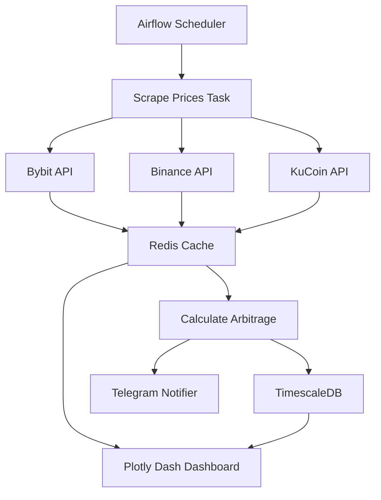

# 💰 Crypto Arbitrage Monitor

A comprehensive, Dockerized cryptocurrency arbitrage monitoring system that tracks price differences across multiple exchanges (Bybit, Binance, KuCoin) and identifies profitable trading opportunities in real-time.

## 🌟 Features

- **Multi-Exchange Support**: Monitors prices from Bybit, Binance, and KuCoin
- **Real-Time Monitoring**: Asynchronous price scraping using official public APIs
- **Arbitrage Detection**: Automatically calculates profit opportunities after exchange fees
- **Smart Notifications**: Telegram alerts for profitable opportunities
- **Historical Analysis**: Long-term data storage with TimescaleDB
- **Beautiful Dashboard**: Interactive Plotly Dash visualization with auto-refresh
- **Workflow Orchestration**: Airflow-powered scheduling and task management
- **Fully Dockerized**: One-command deployment with Docker Compose

## 📊 Monitored Cryptocurrencies

- Bitcoin (BTC)
- Ethereum (ETH)
- Binance Coin (BNB)
- Solana (SOL)
- Tron (TRX)
- Dogecoin (DOGE)
- Cardano (ADA)

## 🏗️ Architecture



## 🛠️ Technology Stack

- **Languages**: Python 3.11
- **Workflow**: Apache Airflow
- **Databases**: Redis (cache), TimescaleDB (time-series)
- **APIs**: Bybit SDK, Binance Public API, KuCoin Public API
- **Data Processing**: Pandas
- **Visualization**: Plotly Dash with Bootstrap
- **Notifications**: python-telegram-bot
- **Containerization**: Docker & Docker Compose

## 📁 Project Structure

```
D:\crypto-arbitrage-monitor\
├── docker-compose.yml          # Multi-service orchestration
├── Dockerfile                  # Application container
├── requirements.txt            # Python dependencies
├── .env                        # Environment variables
├── .env.example               # Environment template
├── README.md                  # This file
├── INSTALL.md                 # Installation guide
├── airflow/
│   ├── dags/
│   │   └── arbitrage_monitor_dag.py  # Main Airflow workflow
│   └── logs/
├── src/
│   ├── config.py              # Configuration management
│   ├── models.py              # Data models
│   ├── scrapers/              # Exchange scrapers
│   │   ├── bybit_scraper.py
│   │   ├── binance_scraper.py
│   │   └── kucoin_scraper.py
│   ├── processors/            # Data processing
│   │   └── arbitrage_calculator.py
│   ├── storage/               # Database clients
│   │   ├── redis_client.py
│   │   └── timescale_client.py
│   ├── notifications/         # Alert system
│   │   └── notifier.py
│   └── dashboard/             # Web interface
│       ├── app.py
│       └── components/
│           └── graphs.py
└── scripts/
    └── setup_databases.py     # DB initialization
```

## 🚀 Quick Start

See [INSTALL.md](INSTALL.md) for detailed installation instructions.

### Prerequisites

- Docker Desktop installed and running
- Docker Compose v2.0+
- (Optional) Telegram account for notifications

### One-Command Start

```powershell
cd D:\crypto-arbitrage-monitor
docker-compose up -d
```

### Access Points

- **Dashboard**: http://localhost:8050
- **Airflow UI**: http://localhost:8080 (username: `admin`, password: `admin`)
- **TimescaleDB**: localhost:5432
- **Redis**: localhost:6379

## ⚙️ Configuration

Edit `.env` file to configure:

```bash
# Bybit API (already configured with your credentials)
BYBIT_API_KEY=kOgFNe6wab1hBKezE7
BYBIT_API_SECRET=123456

# Telegram (configure to enable notifications)
TELEGRAM_BOT_TOKEN=your_bot_token
TELEGRAM_CHAT_ID=your_chat_id

# Monitoring settings
COINS=BTC,ETH,BNB,SOL,TRX,DOGE,ADA
SCRAPE_INTERVAL=60
MIN_PROFIT_THRESHOLD=0.5

# Exchange fees (%)
BYBIT_FEE=0.1
BINANCE_FEE=0.1
KUCOIN_FEE=0.1
```

### Setting Up Telegram Notifications

1. **Create a Telegram Bot**:
   - Message [@BotFather](https://t.me/BotFather) on Telegram
   - Send `/newbot` and follow instructions
   - Save the bot token

2. **Get Your Chat ID**:
   - Message your new bot
   - Visit: `https://api.telegram.org/bot<YOUR_BOT_TOKEN>/getUpdates`
   - Find your `chat_id` in the response

3. **Update `.env`**:
   ```bash
   TELEGRAM_BOT_TOKEN=123456789:ABCdefGHIjklMNOpqrsTUVwxyz
   TELEGRAM_CHAT_ID=987654321
   ```

4. **Restart containers**:
   ```powershell
   docker-compose restart
   ```

## 📊 Dashboard Features


The interactive dashboard includes:

- **Real-Time Stats**: Total opportunities, best profit, active pairs
- **Opportunities Table**: Top 20 arbitrage opportunities with color coding
- **Price Comparison**: Bar charts comparing prices across exchanges
- **Arbitrage Heatmap**: Visual representation of profit margins
- **Profit Scatter Plot**: Profitability vs. price difference analysis
- **Price History**: 24-hour time series charts

## 🔔 Notifications

The system sends Telegram alerts when:

- Price difference exceeds exchange fees (profitable opportunity)
- Profit margin is above the configured threshold
- High-value opportunities (>1% profit) are detected

Example notification:

```
🚀 Arbitrage Opportunity Detected!

Coin: BTCUSDT
Buy: KUCOIN at $44,900.00
Sell: BYBIT at $45,200.00
Price Difference: 0.67%
Estimated Profit: 0.47%
Time: 2026-01-28 21:35:00 UTC
```

## 📈 Workflow

The Airflow DAG runs every 60 seconds (configurable) and executes:

1. **Scrape Prices**: Fetch latest prices from all exchanges in parallel
2. **Calculate Arbitrage**: Analyze price differences and calculate profits
3. **Store Historical**: Save data to TimescaleDB for analysis
4. **Send Notifications**: Alert on profitable opportunities

## 🧪 Testing Components

Test individual components:

```powershell
# Test database connection
docker-compose exec dashboard python scripts/setup_databases.py

# Test Bybit scraper
docker-compose exec dashboard python -m src.scrapers.bybit_scraper

# Test Binance scraper
docker-compose exec dashboard python -m src.scrapers.binance_scraper

# Test KuCoin scraper
docker-compose exec dashboard python -m src.scrapers.kucoin_scraper

# Test notifications
docker-compose exec dashboard python -m src.notifications.notifier
```

## 📝 Maintenance

### View Logs

```powershell
# All services
docker-compose logs -f

# Specific service
docker-compose logs -f dashboard
docker-compose logs -f airflow-scheduler
```

### Restart Services

```powershell
docker-compose restart
```

### Stop Everything

```powershell
docker-compose down
```

### Clear Data and Reset

```powershell
docker-compose down -v  # WARNING: Deletes all data
```

## 🔧 Troubleshooting

### Airflow DAG not appearing
- Check logs: `docker-compose logs airflow-scheduler`
- Verify file is in `airflow/dags/` directory
- Refresh Airflow UI

### No prices in dashboard
- Ensure Airflow DAG is running
- Check if Redis is accessible
- Run manual scraper test

### Telegram notifications not working
- Verify bot token and chat ID in `.env`
- Test connection: `docker-compose exec dashboard python -m src.notifications.notifier`

### Database connection errors
- Check if containers are running: `docker-compose ps`
- Verify database credentials in `.env`

## 🎯 Future Enhancements

- [ ] Support for more exchanges (Coinbase, Kraken, etc.)
- [ ] Advanced arbitrage strategies (triangular arbitrage)
- [ ] Machine learning price prediction
- [ ] Automated trade execution (with safety controls)
- [ ] Mobile app for notifications
- [ ] WebSocket for even faster price updates

## 📄 License

This project is for educational and monitoring purposes only. Use at your own risk.

## ⚠️ Disclaimer

**This system is for monitoring purposes only and does not execute trades.** Always verify opportunities manually before trading. Cryptocurrency markets are highly volatile, and arbitrage opportunities may disappear quickly due to:

- Network latency
- Exchange rate limits
- Wallet transfer fees
- Withdrawal restrictions
- Market volatility

## 🤝 Contributing

This is a personal monitoring system. Feel free to fork and customize for your needs.

## 📧 Support

For issues or questions, check the logs and troubleshooting guide in [INSTALL.md](INSTALL.md).

---

**Built with ❤️ for crypto arbitrage monitoring**
